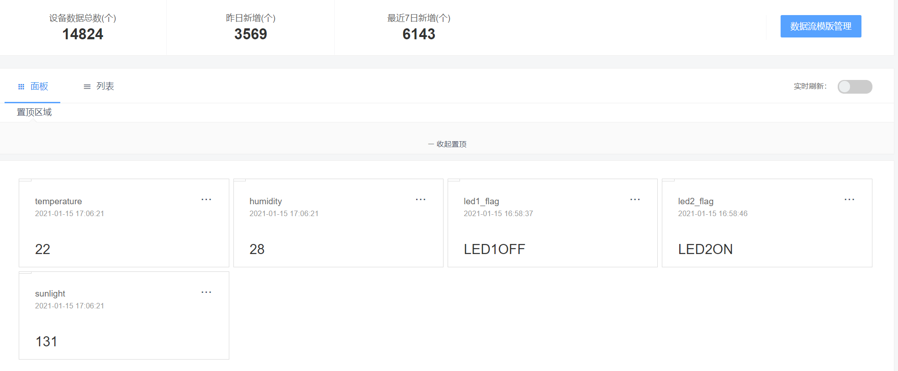
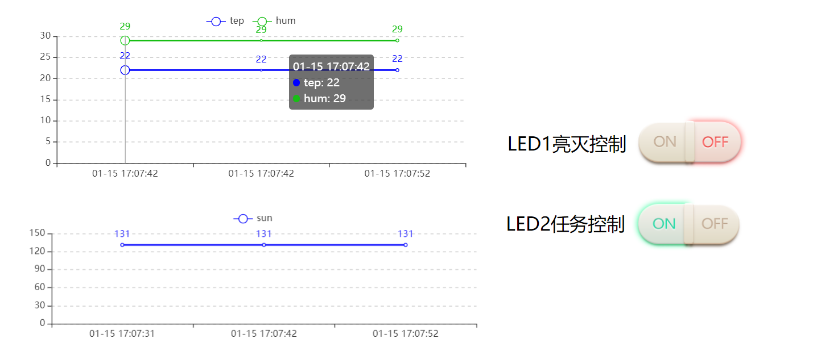
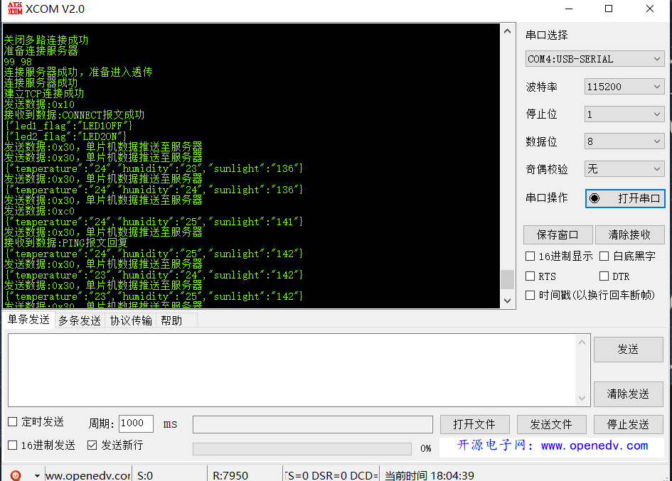
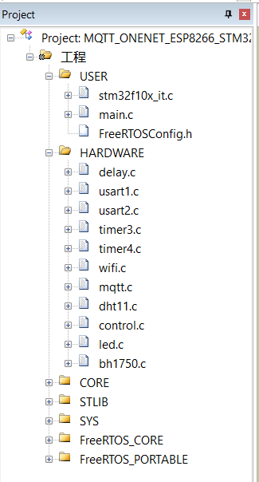
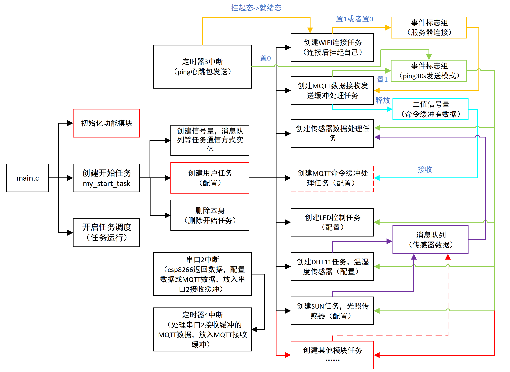

# 【开源】STM32+ESP8266+MQTT上云OneNET（易拓展）

[toc]

**简介：** STM32+ESP8266通过MQTT协议将多传感器数据传输至OnenNet云平台并远程控制单片机LED，**加入操作系统FreeRTOS进行多任务管理，降低模块间耦合性，增删模块和功能简单方便，提高开发效率，可以根据自己的需求快速增加其他传感器模块**

> **拓展新模块（新功能）简单，几乎不需要多少操作系统知识，后面有详细教程（深入修改还是需要一定的操作系统知识的）**

注：部分功能采用他人开源程序或在他人开源程序的基础上修改。

#### 1. 相关连接

##### 1.1 本项目相关连接

1. github（源码）：https://github.com/Mbwide/MQTT_ONENET_ESP8266_STM32_FREERTOS
2. CSDN（图文解析）：https://blog.csdn.net/ssssadw/article/details/112754912
3. Bilibili（视频解析）：

##### 1.2 无操作系统简易版（**旧版，有OneNET云平台设备创建和应用配置，本文不再赘述**）：

1. github（源码）： https://github.com/Mbwide/DHT11_ToOneNetByMqtt
2. CSDN（图文解析）：https://blog.csdn.net/ssssadw/article/details/111584510
3. Bilibili（视频解析）：https://www.bilibili.com/video/BV1Vi4y1w7U1

#### 2. 具体功能

1.  基于嵌入式操作系统FreeRTOS进行多任务管理，**降低模块间耦合性，增删模块和功能简单方便，提高开发效率**
2.  DHT11采集**环境温湿度**数据，ESP8266模块通过MQTT协议将温湿度数据传输至OnenNet云平台
3.  BH1750采集**光照强度**数据，ESP8266模块通过MQTT协议将光照强度数据传输至OnenNet云平台
4.  OneNET可以通过云平台远程控制**LED1的亮灭**
5.  OneNET可以通过云平台远程控制**LED2功能任务**是否执行
6.  串口显示相关数据信息

#### 3. 硬件环境

1. 正点原子STM32F103RCT6（正点原子MiniSTM32）
2. DHT11温湿度传感器
3. BH1750（GY30）光照强度传感器
4. ESP8266-01S无线模块

#### 4. 云平台环境配置

​	**见1.2无操作系统简易版（旧版，有OneNET云平台设备创建和应用配置，本文不再赘述）**

#### 5. 接线

1. ESP8266-01S（5根线）

   - RX	     PA2
   - TX         PA3
   - 复位      PA4 
   - VCC      3V3 
   - GND     GND
2. DHT11（3根线）

   - DATA    PA6 
   - VCC      3V3  
   - GND     GND
3. BH1750（5根线）
   - SCL       PC12
   - SDA      PC11
   - ADDR   GND
   - VCC       5V
   - GND     GND
4. LED
   - LED1     PD2
   - LED2     PA8

#### 6. 功能展示

##### 6.1 数据流

​		

##### 6.2 APP应用管理



##### 6.3 串口数据



#### 7. 源码详解

**本次代码改写目的是增强拓展性，降低开发难度，所以加入操作系统FreeRTOS进行多任务管理，降低模块（传感器，控制）间耦合性，增删模块和功能简单方便，提高开发效率**

##### 7.1 源码文件解析

​	

- stm32f10x_it.c：中断处理函数
- FreeRTOSConfig.h：FreeRTOS配置头文件
- usart1.c：与串口住手通信
- usart2.c：与ESP8266通信
- timer3.c：定时器3中断用来发送心跳包（ping，用于保持和服务器连接，长时间没给服务器发送数据会被踢下线），2s和30s两种模式
- timer4.c：将串口2接收到的服务器数据依次存放在MQTT接收缓存数组中，50ms没有新数据收到执行
- control.c：发送控制设备数据，存放至发送缓冲区
- dht11.c：DHT11（温湿度传感器）驱动
- bh1750.c：BH1750（GY30，光照强度传感器）驱动
- wifi.c：esp8266的wifi驱动
- mqtt.c：mqtt协议处理
- FreeRTOS_CORE：freeRTOS功能核心
- FreeRTOS_PORTABLE：freeRTOS板级支持包，和芯片相关，包括接口和内存分配

##### 7.2 服务器与wifi配置相关

```c
/*-------------------------------------------------------------*/
/*          	WIFI网络与ONENET配置（配置）			      	     */
/*-------------------------------------------------------------*/
const char SSID[] =  "PPP";       //路由器名称
const char PASS[] = "qaz123qaz";  //路由器密码

const char PRODUCTID[] 	     = "394499";  	   //产品ID（改成自己的）
const char DEVICEID []	     = "661126800";    //设备ID（改成自己的）
const char AUTHENTICATION[]  = "123456";       //鉴权信息（改成自己的） 
const char DATA_TOPIC_NAME[] = "$dp";		   //topic，Onenet数据点上传topic（不用改）
const char SERVER_IP[]	     = "183.230.40.39";//存放服务器IP或域名（不用改）
const int  SERVER_PORT 		 = 6002;		   //存放服务器的端口号（不用改）

```

1. 具体OneNET云平台设备创建和应用配置见：

   >  **1.2 无操作系统简易版（旧版，有OneNET云平台设备创建和应用配置，本文不再赘述**）
   >
   > ​	Bilibili（视频解析）：https://www.bilibili.com/video/BV1Vi4y1w7U1

2. 拓展传感器模块详细演示见：

   > **1.1 本项目相关连接** ：
   >
   > ​	Bilibili（视频解析）

##### 7.3 源码框架

1. 括号里有“**配置**”字样的部分是用户必须修改的部分（例程已经配置了LED控制，环境温湿度检测和光照强度监测）

2. **红色**部分为**拓展功能模块**需要独立**编写或者修改**的地方

   **红色虚线**部分根据功能更改，**设备控制**更改创建MQTT命令缓冲处理任务，**传感器设备任务**需要向消息队列发送传感器数据

   - 初始化功能模块：添加**拓展模块的初始化函数**
   - 创建用户任务：添加**拓展模块任务**（传感器数据读取或设备控制）
   - 创建MQTT命令缓冲处理任务：添加**设备控制**命令，并发送设备状态（**传感器设备无需修改**）
   - 创建其他模块任务：实现**传感器数据采集**功能或者**设备控制**相关功能，实现传感器数据采集功能时需要红色虚线部分，设备控制不需要。

3. 要实现连接服务器时**发送控制设备初始状态**的功能需要在创建MQTT数据接收发送缓冲处理任务的connect成功部分添加数据发送函数

4. 其他部分可根据实际需求修改




##### 7.4 main.c源码及解析

```c
/*------------------------------------------------------*/
/*                                                      */
/*            程序main函数，入口函数源文件                  */
/*                                                      */
/*------------------------------------------------------*/

#include "sys.h"
#include "delay.h"	     //包含需要的头文件
#include "usart1.h"      //包含需要的头文件
#include "usart2.h"      //包含需要的头文件
#include "timer3.h"      //包含需要的头文件
#include "timer4.h"      //包含需要的头文件

#include "FreeRTOS.h"	 //FreeRTOS配置头文件
#include "semphr.h" 	 //信号量
#include "queue.h"		 //队列
#include "event_groups.h"//事件标志组

#include "wifi.h"	     //包含需要的头文件
#include "mqtt.h"        //包含需要的头文件
#include "control.h"     //包含需要的头文件 控制模块相关数据发送给服务器
#include "led.h"	     //包含需要的头文件 LED
#include "dht11.h"       //包含需要的头文件 空气温湿度
#include "bh1750.h"      //包含需要的头文件 光照传感器

/*-------------------------------------------------------------*/
/*          	WIFI网络与ONENET配置（配置）			      	     */
/*-------------------------------------------------------------*/
const char SSID[] 			 = "PPP";          //路由器名称
const char PASS[] 			 = "qaz123qaz";    //路由器密码

const char PRODUCTID[] 	     = "394499";  	   //产品ID
const char DEVICEID []	     = "661126800";    //设备ID  
const char AUTHENTICATION[]  = "123456";       //鉴权信息  
const char DATA_TOPIC_NAME[] = "$dp";		   //topic，Onenet数据点上传topic（不用改）
const char SERVER_IP[]	     = "183.230.40.39";//存放服务器IP或域名（不用改）
const int  SERVER_PORT 		 = 6002;		   //存放服务器的端口号（不用改）

/*-------------------------------------------------------------*/
/*          控制命令以及控制模块初始状态设置（配置）		   	     */
/*-------------------------------------------------------------*/
	/* 消息体：
	 *  {
	 *		"data_1":"value_1",
	 *		"data_2":"value_2"
	 *	}
	 *	消息体示例：
	 *	{"led1_flag":"LED1ON"}
	 */

const char *LED1_LABER  = "led1_flag";//LED1标签，发送给ONENET的数据流名称
const char *CMD_LED1ON  = "LED1ON";   //LED1打开
const char *CMD_LED1OFF = "LED1OFF";  //LED1关闭
char 	   *led1_flag   = "LED1OFF";  //LED1状态，初始化为关闭状态

const char *LED2_LABER 	= "led2_flag";//LED2标签
const char *CMD_LED2ON  = "LED2ON";   //LED2打开
const char *CMD_LED2OFF = "LED2OFF";  //LED2关闭
char 	   *led2_flag   = "LED2ON";   //LED2状态，初始化为打开状态
/*-------------------------------------------------------------*/
/*               freerto任务通信控制（固定）			      	    */
/*-------------------------------------------------------------*/

/*	二值信号量句柄                         
 *	作用：用于控制MQTT命令缓冲处理任务，在MQTT数据接收发送缓冲处理任务中发出
 *		  当命令缓冲区收到命令数据时，发出信号量		 
 */
SemaphoreHandle_t BinarySemaphore;
	
/*	事件标志组                         
 *	作用：标志WIFI连接，PING心跳包发送模式控制wifi是否重启连接，是否发送数据，传感器是否运行 
 *  具体：1.事件标志组位1为0，位0为1时，即0x03（0000 0001），wifi连接至服务器时位0置位1，此时connect报文还未发送。 
 *		  2.事件标志组位1为1，位0为1时，即0x03（0000 0011），connect报文发送，返回连接成功报文时位1置位1，PING心
 *			跳包开启30s发送模式，传感器任务开启，数据开始上传，设备远程控制（LED控制）功能开启。 
 */
EventGroupHandle_t Event_Handle = NULL;     //事件标志组（位0：WIFI连接状态 位1：PING心跳包2S快速发送模式）
const int WIFI_CONECT = (0x01 << 0);        //设置事件掩码的位 0；服务器连接模式，值1表示已经连接，0表示未连接
const int PING_MODE   = (0x01 << 1);        //设置事件掩码的位 1；PING心跳包发送模式，1表示开启30S发送模式，0表示未开启发送或开启2S快速发送模式

/*	传感器数据发送消息队列                         
 *	作用：将传感器的数据发送到传感器消息队列  
 */
QueueHandle_t Message_Queue;		 		//消息队列句柄  
const UBaseType_t MESSAGE_DATA_TX_NUM = 5;	//消息队列最大消息数目  
const UBaseType_t MESSAGE_DATA_TX_LEN = 100;//消息队列单元大小，单位为字节  

/*-------------------------------------------------------------*/
/*               任务句柄及任务函数声明1（配置）		      	     */
/*-------------------------------------------------------------*/
//开始任务
TaskHandle_t StartTask_Handler;
void my_start_task(void *pvParameters);
//LED任务 
TaskHandle_t Led2_Task_Handler;
void my_led2_task(void *pvParameters);
//DHT11任务 温湿度传感器
TaskHandle_t DHT11_Task_Handler;
void my_dht11_task(void *pvParameters);
//SUN任务，光照传感器
TaskHandle_t SUN_Task_Handler;
void my_sun_task(void *pvParameters);
//MQTT命令缓冲处理任务
TaskHandle_t MQTT_Cmd_Task_Handler;
void my_mqtt_buffer_cmd_task(void *pvParameters);

/*-------------------------------------------------------------*/
/*               任务句柄及任务函数声明2（固定）		      	     */
/*-------------------------------------------------------------*/
//WIFI任务
TaskHandle_t WIFI_Task_Handler;
void wifi_task(void *pvParameters);
//MQTT数据接收发送缓冲处理任务
TaskHandle_t MQTT_RxTx_Task_Handler;
void mqtt_buffer_rx_tx_task(void *pvParameters);
//传感器数据处理任务，处理待发送的传感器数据，移入MQTT数据发送缓冲区
TaskHandle_t DATA_TX_Task_Handler;
void data_tx_to_buffer_task(void *pvParameters);

/*---------------------------------------------------------------*/
/*函数名：int main()                                              */
/*功  能：主函数							                         */
/*		  1.初始化各功能模块  				     				   */
/*		  2.创建开始任务（在开始任务里创建所有其他任务）                */
/*		  3.开启任务调度				       			 		     */
/*参  数：无                          			   				  */
/*返回值：无                                       			     */
/*---------------------------------------------------------------*/
int main()
{
	NVIC_PriorityGroupConfig(NVIC_PriorityGroup_4);//设置系统中断优先级分组4
	delay_init();	       //延时函数初始化
	usart1_init(115200);   //串口1功能初始化，波特率115200，与串口住手通信		
	usart2_init(115200);   //串口2功能初始化，波特率115200，wifi通信	
	tim4_init(500,7200);   //TIM4初始化，定时时间 500*7200*1000/72000000 = 50ms	
	led_init();		  	   //初始化LED
	dht11_init();  		   //初始化DHT11 温湿度
	iic_by30_init();       //初始化IIC接口 光照强度
	
	wifi_reset_io_init();  //初始化esp8266
	IoT_parameter_init();  //初始化OneNET平台MQTT服务器的参数	
	
	//创建开始任务
	xTaskCreate((TaskFunction_t	) my_start_task,		//任务函数
			    (const char* 	)"my_start_task",		//任务名称
				(uint16_t 		) 128,				  	//任务堆栈大小
				(void* 		  	) NULL,				 	//传递给任务函数的参数
				(UBaseType_t 	) 1, 				  	//任务优先级
				(TaskHandle_t*  ) &StartTask_Handler);	//任务控制块 
			
	vTaskStartScheduler();  							//开启任务调度
}

/*---------------------------------------------------------------*/
/*函数名：void my_start_task(void *pvParameters)                  */
/*功  能：开始任务（配置）							                 */
/*		  1.创建信号量，消息队列等任务通信方式   				     */
/*		  2.创建所有任务       			 						 */
/*		  3.删除本身       			 		    				  */
/*参  数：无                          			   				  */
/*返回值：无                                       			      */
/*---------------------------------------------------------------*/
void my_start_task(void *pvParameters)
{
	taskENTER_CRITICAL(); //进入临界区
	
	//创建二值信号量
	BinarySemaphore = xSemaphoreCreateBinary();	
	//事件标志组，用于标志wifi连接状态以及ping发送状态
	Event_Handle = xEventGroupCreate(); 
	//创建传感器消息体消息队列
	Message_Queue = xQueueCreate(MESSAGE_DATA_TX_NUM, MESSAGE_DATA_TX_LEN); 
	
	//任务创建函数参数；1.任务函数 2.任务名称 3.任务堆栈大小 3.传递给任务函数的参数 4.任务优先级 5.任务控制块
	//创建WIFI任务
    xTaskCreate(wifi_task, 				"wifi_task", 				128, NULL, 7, &WIFI_Task_Handler); 			
	//创建MQTT命令缓冲处理任务
    xTaskCreate(my_mqtt_buffer_cmd_task,"my_mqtt_buffer_cmd_task",  128, NULL, 6, &MQTT_Cmd_Task_Handler); 			
	//创建MQTT数据接收发送缓冲处理任务
    xTaskCreate(mqtt_buffer_rx_tx_task, "mqtt_buffer_rx_tx_task", 	256, NULL, 5, &MQTT_RxTx_Task_Handler); 
	//创建led控制任务
	xTaskCreate(my_led2_task, 			"my_led2_task",				128, NULL, 4, &Led2_Task_Handler);  
    //创建DHT11任务，温湿度传感器
    xTaskCreate(my_dht11_task, 			"my_dht11_task", 			128, NULL, 3, &DHT11_Task_Handler);
    //创建SUN任务，光照传感器
    xTaskCreate(my_sun_task, 			"my_sun_task",        		128, NULL, 3, &SUN_Task_Handler);	
	//创建传感器数据处理任务，处理待发送的传感器数据，移入MQTT数据发送缓冲区
    xTaskCreate(data_tx_to_buffer_task, "data_tx_to_buffer_task", 	512, NULL, 2, &DATA_TX_Task_Handler); 
			
    vTaskDelete(StartTask_Handler); //删除开始任务
    taskEXIT_CRITICAL();            //退出临界区
}

/*---------------------------------------------------------------*/
/*函数名：void my_mqtt_buffer_cmd_task(void *pvParameters)        */
/*功  能：MQTT命令缓冲处理任务（配置）							       */
/*		  1.MQTT命令缓冲区处理，并执行相应命令     				  */
/*		  2.将命令执行结果发送给服务器       			 		    */
/*参  数：无                          			   				  */
/*返回值：无                                       			     */
/*其  他：获取到二值信号量时执行（收到服务器命令）                      */
/*---------------------------------------------------------------*/
void my_mqtt_buffer_cmd_task(void *pvParameters)	
{
	while(1)
	{
		xSemaphoreTake(BinarySemaphore, portMAX_DELAY);	//获取信号量，获取到信号量，继续执行，否则进入阻塞态，等待执行
		if(MQTT_CMDOutPtr != MQTT_CMDInPtr)				//if成立的话，说明命令缓冲区有数据了	
		{                             		       
			printf("命令:%s\r\n", &MQTT_CMDOutPtr[2]);              	   
			
			if(!memcmp(&MQTT_CMDOutPtr[2], CMD_LED1ON, strlen(CMD_LED1ON)))
			{                                            
				led1_on();  		  //LED1开启
				led1_flag = "LED1ON"; //LED1状态，用于发送给服务器
				send_data(LED1_LABER, led1_flag);
			}
			else if(!memcmp(&MQTT_CMDOutPtr[2], CMD_LED1OFF, strlen(CMD_LED1OFF)))
			{                                           
				led1_off(); 		  //LED1关闭
				led1_flag = "LED1OFF";//LED1状态，用于发送给服务器  
				send_data(LED1_LABER, led1_flag);
			}
			if(!memcmp(&MQTT_CMDOutPtr[2], CMD_LED2ON, strlen(CMD_LED2ON)))
			{                                            
				vTaskResume(Led2_Task_Handler);  //LED2任务由挂起态转为就绪态，LED2任务运行
				led2_flag = "LED2ON"; 		     //LED2状态，用于发送给服务器
				send_data(LED2_LABER, led2_flag);
			}
			else if(!memcmp(&MQTT_CMDOutPtr[2], CMD_LED2OFF, strlen(CMD_LED2OFF)))
			{                                      
				vTaskSuspend(Led2_Task_Handler); //LED2任务由就绪态（运行态）转为挂起态，LED2任务挂起（停止）  
				led2_flag = "LED2OFF";			 //LED2状态，用于发送给服务器	
				send_data(LED2_LABER, led2_flag);
			}					
			//不做处理，后面会发送状态
			else printf("未知指令\r\n");				
		
			MQTT_CMDOutPtr += CBUFF_UNIT;		//指针下移
			if(MQTT_CMDOutPtr == MQTT_CMDEndPtr)//如果指针到缓冲区尾部了
			MQTT_CMDOutPtr = MQTT_CMDBuf[0];    //指针归位到缓冲区开头	
					
		}
		delay_ms(10);	  
	}
}

/*---------------------------------------------------------------*/
/*函数名：void my_dht11_task(void *pvParameters)                  */
/*功  能：DHT11任务 温湿度传感器（配置）							  */
/*		  1.检测环境温湿度数据      							      */
/*		  2.将环境温湿度数据放入传感器数据消息队列       			   */
/*参  数：无                          			   				 */
/*返回值：无                                       			     */
/*其  他：服务器连接以及PING心跳包30S发送模式事件发生时执行此任务，      */
/*		  否则挂起任务   									        */
/*---------------------------------------------------------------*/
void my_dht11_task(void *pvParameters)
{
	
	while(1)
	{
		char humidity;		   //定义一个变量，保存湿度值
		char temperature;	   //定义一个变量，保存温度值	
		char data_of_sensor[50] = {0};
		
		//服务器连接以及PING心跳包30S发送模式事件发生时执行此任务，否则挂起任务
		xEventGroupWaitBits((EventGroupHandle_t	)Event_Handle,		
							(EventBits_t		)PING_MODE,
							(BaseType_t			)pdFALSE,				
							(BaseType_t			)pdTRUE,
							(TickType_t			)portMAX_DELAY);
	
		
		dht11_read_data(&temperature, &humidity);//读取温湿度值
		//构建消息体
		//消息体："temperature":"%d","humidity":"%d",
		sprintf(data_of_sensor, "\"temperature\":\"%d\",\"humidity\":\"%d\",", temperature, humidity);  		
	
		
		xQueueSend(Message_Queue, &data_of_sensor, portMAX_DELAY);//向消息队列发送消息体，将温湿度数据放入传感器数据消息队列
		//printf("temperature: %d, humidity: %d \r\n", temperature, humidity);
		delay_ms(10 * 1000);//延时10s
	}
} 

/*---------------------------------------------------------------*/
/*函数名：void my_led2_task(void *pvParameters)                   */
/*功  能：LED任务（配置）									       */
/*		  1.LED2任务执行       							          */
/*参  数：无                          			   				  */
/*返回值：无                                       			      */
/*其  他：服务器连接以及ping心跳包30S发送模式事件发生时执行此任务，       */
/*		  否则挂起任务   									         */
/*---------------------------------------------------------------*/
void my_led2_task(void *pvParameters)
{
	while(1)
	{
		//服务器连接以及ping心跳包30S发送模式事件发生时执行此任务，否则挂起任务
		xEventGroupWaitBits((EventGroupHandle_t	)Event_Handle,		
							(EventBits_t		)PING_MODE,
							(BaseType_t			)pdFALSE,				
							(BaseType_t			)pdTRUE,
							(TickType_t			)portMAX_DELAY);
		led2_on();
		delay_ms(500);	//延时500ms
		led2_off();
		delay_ms(500);	//延时500ms
	}
}

/*---------------------------------------------------------------*/
/*函数名：void my_sun_task(void *pvParameters)                   */
/*功  能：SUN任务，光照传感器（配置）							      */
/*		  1.检测光照强度       							        */
/*		  2.将光照强度数据放入传感器数据消息队列       			    */
/*参  数：无                          			   				 */
/*返回值：无                                       			     */
/*其  他：服务器连接以及PING心跳包30S发送模式事件发生时执行此任务，      */
/*		  否则挂起任务   									        */
/*---------------------------------------------------------------*/
void my_sun_task(void *pvParameters)
{

	while(1)
	{
		int  sun_light;	 //定义一个变量，保存光照强度
		char data_of_sensor[50] = {0};
		
		//服务器连接以及ping心跳包30S发送模式事件发生时执行此任务，否则挂起任务
		xEventGroupWaitBits((EventGroupHandle_t	)Event_Handle,		
							(EventBits_t		)PING_MODE,
							(BaseType_t			)pdFALSE,				
							(BaseType_t			)pdTRUE,
							(TickType_t			)portMAX_DELAY);	
	
		
		sun_light = get_sunlight_value();	
		//构建消息体
		//消息体："sunlight":"%d",
		sprintf(data_of_sensor, "\"sunlight\":\"%d\",", sun_light); //构建消息体的一部分
	
		
		xQueueSend(Message_Queue, &data_of_sensor, portMAX_DELAY);  //向消息队列发送消息体，将光照强度数据放入传感器数据消息队列
		//printf("sunlight: %d \r\n", sun_light);
		delay_ms(10 * 1000);	    //延时10s
	}
} 

/*---------------------------------------------------------------*/
/*函数名：void wifi_task(void *pvParameters)                      */
/*功  能：WIFI任务（固定）										   */
/*		  1.连接wifi以及云服务器       							   */
/*		  2.断线重连        									  */
/*参  数：无                          			   				 */
/*返回值：无                                       			     */
/*其  他：1.服务器连接前关闭发送ping包的定时器3，清除事件标志位	      */
/*		  2.服务器已连接，抛出事件标志，挂起自己，进入挂起态		    */
/*		  3.服务器或者wifi已断开，清除事件标志，继续执行本任务重新      */
/*			连接	 											   */
/*---------------------------------------------------------------*/
void wifi_task(void *pvParameters)
{
	while(1)
	{ 
		printf("需要连接服务器\r\n");                 
		TIM_Cmd(TIM4, DISABLE);                       //关闭TIM4 
		TIM_Cmd(TIM3, DISABLE);                       //关闭TIM3
		xEventGroupClearBits(Event_Handle, PING_MODE);//关闭发送PING包的定时器3，清除事件标志位
		WiFi_RxCounter = 0;                           //WiFi接收数据量变量清零                        
		memset(WiFi_RX_BUF, 0, WiFi_RXBUFF_SIZE);     //清空WiFi接收缓冲区 
		if(WiFi_Connect_IoTServer() == 0)			  //如果WiFi连接云服务器函数返回0，表示正确，进入if
		{   			     
			printf("建立TCP连接成功\r\n");            
			WiFi_RxCounter = 0;                       //WiFi接收数据量变量清零                        
			memset(WiFi_RX_BUF, 0, WiFi_RXBUFF_SIZE); //清空WiFi接收缓冲区 
			MQTT_Buff_Init();                         //初始化发送缓冲区  
			
			xEventGroupSetBits(Event_Handle, WIFI_CONECT);  //服务器已连接，抛出事件标志 
			vTaskSuspend(NULL);	    						//服务器已连接，挂起自己，进入挂起态（任务由挂起转为就绪态时在这继续执行下去）
			xEventGroupClearBits(Event_Handle, WIFI_CONECT);//服务器或者wifi已断开，清除事件标志，继续执行本任务，重新连接 
			xEventGroupClearBits(Event_Handle, PING_MODE);  //关闭发送PING包的定时器3，清除事件标志位
		}
		delay_ms(10);	    //延时10s
	}
}

/*---------------------------------------------------------------*/
/*函数名：void data_tx_to_buffer_task(void *pvParameters)         */
/*功  能：传感器数据处理任务（固定）							      */			
/*		  1.处理待发送的传感器数据，移入MQTT数据发送缓冲区             */
/*参  数：无                          			   				 */
/*返回值：无                                       			     */
/*其  他：服务器连接以及ping心跳包30S发送模式事件发生时执行此任务，      */
/*		  否则挂起任务   									        */
/*---------------------------------------------------------------*/
void data_tx_to_buffer_task(void *pvParameters)
{
	while(1)
	{				
		char data_buffer[255] = {0};//数据包缓存区,初始化为0
		int data_len = 0;			//数据包总长度，初始化为0
		int data_msg_len = 0;		//消息体长度，初始化为0
		//服务器连接以及ping心跳包30S发送模式事件发生时执行此任务，否则挂起任务
		xEventGroupWaitBits((EventGroupHandle_t	)Event_Handle,		
							(EventBits_t		)PING_MODE,
							(BaseType_t			)pdFALSE,				
							(BaseType_t			)pdTRUE,
							(TickType_t			)portMAX_DELAY);
		
		/*  数据包解析（数据类型3）
		 *	0:0x03 固定报头（数据点类型，此处为3）
		 *	1:	   消息体长度高字节（消息体长度不超过255个字节则为0x00）
		 *	2:	   消息体长度低字节（消息体长度，即数据包长度，自己设置）
		 *	3-结尾 消息体
		 *  消息体：
		 *  {
		 *		"data_1":"value_1",
		 *		"data_2":"value_2"
		 *	}
		 *	消息体示例：
		 *	{"temperature":"22","humidity":"33"}
		 */	 
		sprintf(data_buffer + 3, "{");//构建报文
		if (xQueueReceive(Message_Queue, data_buffer + 4 + strlen(data_buffer + 4), 10))
		{
			while (xQueueReceive(Message_Queue, data_buffer + 4 + strlen(data_buffer + 4), 10))
			{
			}	
			sprintf(data_buffer + 3 + strlen(data_buffer + 4), "}");// "}"覆盖消息体最后一个","
			
			data_msg_len = strlen(data_buffer + 3);			//消息体长度计算
			data_buffer[0] = 0x03;							//固定报头
			data_buffer[1] = data_msg_len >> 8 ; 			//消息体长度高字节
			data_buffer[2] = data_msg_len & 0xFF;			//消息体长度低字节
			data_len = data_msg_len + 3;   		 	    	//数据包总长度
			
			printf("%s\r\n", data_buffer + 3);	      		//消息体通过串口回显
			
			taskENTER_CRITICAL(); //进入临界区，防止中断打断
			MQTT_PublishQs0(DATA_TOPIC_NAME, data_buffer, data_len);//添加数据，发布给服务器
			taskEXIT_CRITICAL();  //退出临界区
		}
		delay_ms(10 * 1000);	  //延时10s
	}
}

/*---------------------------------------------------------------*/
/*函数名：void mqtt_buffer_rx_tx_task(void *pvParameters)         */
/*功  能：MQTT接收发送处理任务（固定）							      */
/*		  1.处理发送缓冲区数据       							  */
/*		  2.处理接收缓冲区数据，并回显给串口住手接收的数据；若接收       */
/*		    缓冲区有服务器命令，则移至命令缓冲区				        */
/*参  数：无                          			   				 */
/*返回值：无                                       			     */
/*其  他：1.服务器连接事件发生执行此任务，否则挂起				     */
/*		  2.接收到服务器命令时给出二值信号量				 		 */
/*		  3.CONNECT报文成功，启动30s的PING定时器，设置事件标志位	   */
/*		  4.PING报文快速发送模式（2s）收到回复，启动30s的ping定时	  */
/*			器，设置事件标志位			 						  */
/*		  5.CONNECT报文失败，WIFI连接服务器任务由挂起态转为就绪态，    */
/*			重启连接											  */
/*---------------------------------------------------------------*/
void mqtt_buffer_rx_tx_task(void *pvParameters)
{
	while(1)
	{
		//服务器连接事件发生执行此任务，否则挂起
		xEventGroupWaitBits((EventGroupHandle_t	)Event_Handle,		
							(EventBits_t		)WIFI_CONECT,
							(BaseType_t			)pdFALSE,				
							(BaseType_t			)pdTRUE,
							(TickType_t			)portMAX_DELAY);
		/*-------------------------------------------------------------*/
		/*                     处理发送缓冲区数据					     */
		/*-------------------------------------------------------------*/
		if(MQTT_TxDataOutPtr != MQTT_TxDataInPtr) //if成立的话，说明发送缓冲区有数据了
		{                
			//发送数据回显
			if(MQTT_TxDataOutPtr[2] == 0x30) 
			{	
				printf("发送数据:0x30，单片机数据推送至服务器\r\n");
			}
			else
			{  
				printf("发送数据:0x%x\r\n", MQTT_TxDataOutPtr[2]);
			}
			
			MQTT_TxData(MQTT_TxDataOutPtr);					
			MQTT_TxDataOutPtr += TBUFF_UNIT;				
			if(MQTT_TxDataOutPtr == MQTT_TxDataEndPtr)		
			{ 
				MQTT_TxDataOutPtr = MQTT_TxDataBuf[0];	
			}			
		}					
		/*-------------------------------------------------------------*/
		/*                     处理接收缓冲区数据                         */
		/*-------------------------------------------------------------*/
		if(MQTT_RxDataOutPtr != MQTT_RxDataInPtr) //if成立的话，说明接收缓冲区有数据了	
		{		
			printf("接收到数据:");

			//if判断，如果第一个字节是0x30，表示收到的是服务器发来的推送数据
			//我们要提取控制命令
			if((MQTT_RxDataOutPtr[2] == 0x30))
			{ 
				printf("服务器等级0推送\r\n"); 		   	//串口输出信息 
				MQTT_DealPushdata_Qs0(MQTT_RxDataOutPtr);//处理等级0推送数据
				xSemaphoreGive(BinarySemaphore);	     //给出二值信号量，控制MQTT命令缓冲处理任务执行
			}	
			
			//if判断，如果第一个字节是0x20，表示收到的是CONNACK报文
			//接着我们要判断第4个字节，看看CONNECT报文是否成功
			else if(MQTT_RxDataOutPtr[2] == 0x20)
			{             			
				switch(MQTT_RxDataOutPtr[5])
				{					   
					case 0x00: printf("CONNECT报文成功\r\n");				 //CONNECT报文成功					   
							   TIM3_ENABLE_30S();				 			//启动30s的PING定时器	
							   xEventGroupSetBits(Event_Handle, PING_MODE); //启动30s的PING定时器，设置事件标志位
							   send_data(LED1_LABER,led1_flag);				//发送控制模块初始数据
							   send_data(LED2_LABER,led2_flag);				//发送控制模块初始数据
							   break;													                                         
					case 0x01: printf("连接已拒绝，不支持的协议版本，准备重启\r\n");       
							   vTaskResume(WIFI_Task_Handler);				//WIFI连接服务器任务由挂起态转为就绪态，重启连接
							   break;														
					case 0x02: printf("连接已拒绝，不合格的客户端标识符，准备重启\r\n");   
							   vTaskResume(WIFI_Task_Handler);              //WIFI连接服务器任务由挂起态转为就绪态，重启连接
							   break; 														
					case 0x03: printf("连接已拒绝，服务端不可用，准备重启\r\n");	    
							   vTaskResume(WIFI_Task_Handler);				//WIFI连接服务器任务由挂起态转为就绪态，重启连接
							   break;														
					case 0x04: printf("连接已拒绝，无效的用户名或密码，准备重启\r\n");	   
							   vTaskResume(WIFI_Task_Handler);				//WIFI连接服务器任务由挂起态转为就绪态，重启连接					
							   break;														
					case 0x05: printf("连接已拒绝，未授权，准备重启\r\n");				   
							   vTaskResume(WIFI_Task_Handler);				//WIFI连接服务器任务由挂起态转为就绪态，重启连接					
							   break;																
					default  : printf("连接已拒绝，未知状态，准备重启\r\n");		     
							   vTaskResume(WIFI_Task_Handler);				//WIFI连接服务器任务由挂起态转为就绪态，重启连接			
							   break;													
				}				
			}			
			//if判断，第一个字节是0xD0，表示收到的是PINGRESP报文
			else if(MQTT_RxDataOutPtr[2] == 0xD0)
			{ 
				printf("PING报文回复\r\n");                       
				if(pingFlag == 1)
				{                   						     //如果pingFlag=1，表示第一次发送
					pingFlag = 0;    				       		 //要清除pingFlag标志
				}
				else if(pingFlag > 1)	
				{ 				 								 //如果pingFlag>1，表示是多次发送了，而且是2s间隔的快速发送
					pingFlag = 0;     				      		 //要清除pingFlag标志
					TIM3_ENABLE_30S(); 				      		 //PING定时器重回30s的时间
					xEventGroupSetBits(Event_Handle, PING_MODE); //30s的PING定时器，设置事件标志位
				}				
			}
			
			MQTT_RxDataOutPtr += RBUFF_UNIT;                //指针下移
			if(MQTT_RxDataOutPtr == MQTT_RxDataEndPtr)      //如果指针到缓冲区尾部了
			{
				MQTT_RxDataOutPtr = MQTT_RxDataBuf[0];      //指针归位到缓冲区开头              
			}		          
		}			
		delay_ms(100);//延时10ms
	}
}

/*---------------------------------------------------------------*/
/*函数名：void stack_task(void *pvParameters)                     */
/*功  能：任务堆栈大小测试（固定）							    	   */			
/*		  1.查看任务运行时堆栈大小，用于调试          			      */
/*参  数：无                          			   				  */
/*返回值：无                                       			     */
/*---------------------------------------------------------------*/
//void stack_task(void *pvParameters)
//{
//	TaskHandle_t TaskHandle;	
//	TaskStatus_t TaskStatus;
//	int i = 0;
//	while(1)
//	{
////		xEventGroupWaitBits((EventGroupHandle_t	)Event_Handle,		
////							(EventBits_t		)WIFI_CONECT|PING_MODE,
////							(BaseType_t			)pdFALSE,				
////							(BaseType_t			)pdTRUE,
////							(TickType_t			)portMAX_DELAY);
////		LED_On();
////		delay_ms(500);			//延时0.5s
////		LED_Off();
////		delay_ms(500);			//延时0.5s
//	
//		for(i = 0; i < 5; i++)
//		{
//			if (i == 0)
//			{
//				TaskHandle = WIFI_Task_Handler;			//根据任务名获取任务句柄。
//			}
//			else if (i == 1)
//			{
//				TaskHandle = MQTT_Cmd_Task_Handler;		//根据任务名获取任务句柄。
//			}
//			else if (i == 2)
//			{
//				TaskHandle = MQTT_RxTx_Task_Handler;	//根据任务名获取任务句柄。
//			}	
//			else if (i == 3)
//			{
//				TaskHandle = DHT11_Task_Handler;		//根据任务名获取任务句柄。
//			}	
//			else if (i == 4)
//			{
//				TaskHandle = DATA_TX_Task_Handler;		//根据任务名获取任务句柄。
//			}				
//			
//			//获取任务信息
//			vTaskGetInfo((TaskHandle_t	)TaskHandle, 	//任务句柄
//						 (TaskStatus_t*	)&TaskStatus, 	//任务信息结构体
//						 (BaseType_t	)pdTRUE,		//允许统计任务堆栈历史最小剩余大小
//						 (eTaskState	)eInvalid);		//函数自己获取任务运行壮态
//			//通过串口打印出指定任务的有关信息。
//			printf("任务名:                %s\r\n",TaskStatus.pcTaskName);
//			printf("任务编号:              %d\r\n",(int)TaskStatus.xTaskNumber);
//			printf("任务壮态:              %d\r\n",TaskStatus.eCurrentState);
//			printf("任务当前优先级:         %d\r\n",(int)TaskStatus.uxCurrentPriority);
//			printf("任务基优先级:           %d\r\n",(int)TaskStatus.uxBasePriority);
//			printf("任务堆栈基地址:         %#x\r\n",(int)TaskStatus.pxStackBase);
//			printf("任务堆栈历史剩余最小值:%d\r\n",TaskStatus.usStackHighWaterMark);
//		}
//		delay_ms(10 * 1000);	    //延时10s
//	}
//}
```

#### 8 总结

##### 8.1 可以改进的地方

1. 串口2接收esp8266发来的MQTT数据可使用DMA功能
2. 定时器4处理串口2接收缓冲的MQTT数据可由中断处理改为任务处理
3. 暂时无法兼容其他平台，修改部分代码（主要是传感器数据处理任务）可实现兼容其他平台，如百度云。

